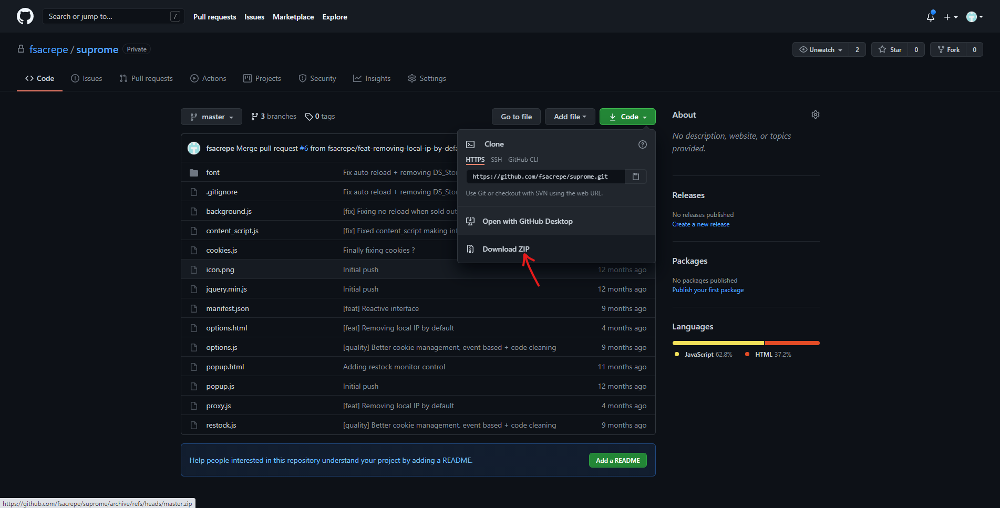
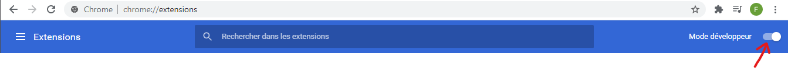
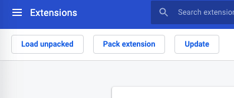
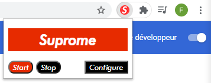
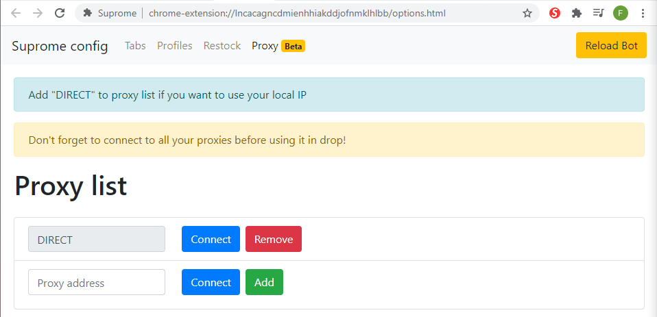
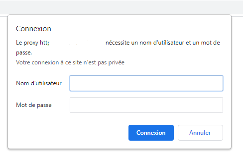
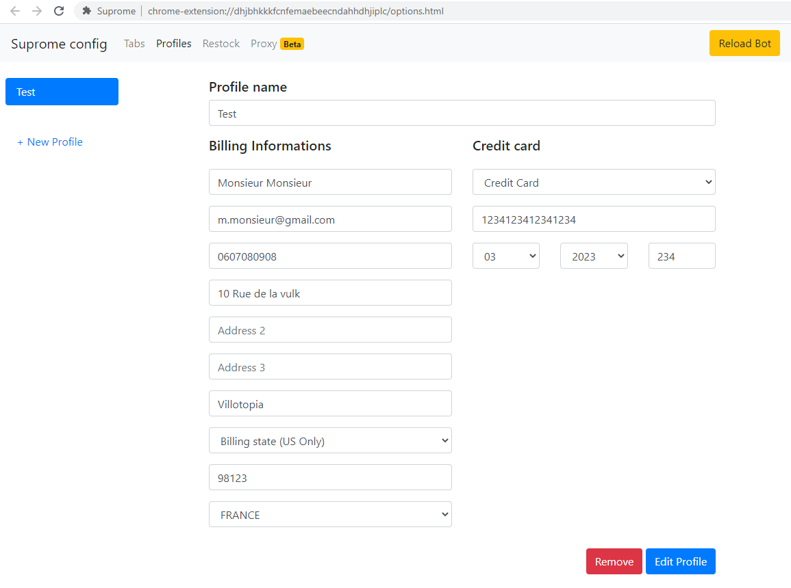
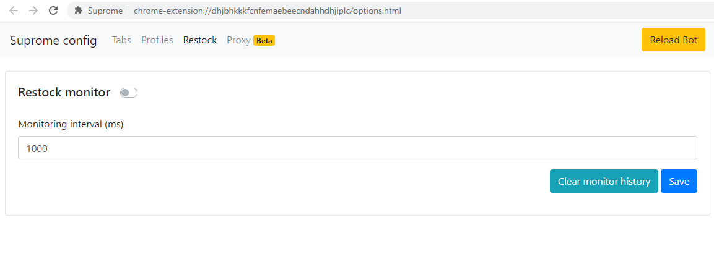

# Suprome

Suprome is a chrome based Supreme bot I've worked on last year during lockdown. I coded it for myself but I figured it doesn't make any sense to keep it just for me.  Hope it will help you cook :man_cook:

It supports multitasking on same instance, proxies and multiple profiles. As a bonus :gift:, you also have a small built in restock monitor

### Table of content

- [How to install](#how-to-install)
- [Setting up](#setting-up)
  - [Proxy](#proxy)
  - [Profile](#profile)
  - [Tabs](#tabs)
  - [Restock monitor](#restock-monitor)
- [Cooking](#cooking)
- [Contributing](#contributing)
- [License](#license)

### How to install

Before installing the Chrome extension you should make sure your Chrome version is up to date to ensure nothing goes wrong with Chrome API endpoints used in the extension.

That being said, let's get to it.

First download the code

Extract the ZIP file, open a new Chrome tab and type `chrome://extensions` in the searchbar.

You'll have to toggle the Developer Mode

Then load the extension using the "Load unpacked" button that appeared after toggling the Developer Mode

You should now see the extension in the list, congrats  :tada: 

### Setting up

Suprome allows you to set up proxies, profiles and tasks to run multiple tasks. We'll see how to setup and how to use all those features in this section so you can get the most out of the bot.

Going to the settings is straight forward, click on the extension icon, then click on "Configure"

#### Proxy

We'll first setup proxy because right now you just cannot go to Supreme's website without it.

You have two options, you can either use your local IP, which is the go to most of time, or you can use an HTTP proxy.

1. #####  Using local IP

   To use your local IP, you just have to add "DIRECT" in proxy list, no need to click on "Connect" as you do not need to log into any proxy.

   

2. ##### Using HTTP proxy

   Most of HTTP proxies are provided in the following format: `username:password@host:port`

   In order to use HTTP proxies you'll have to add the `host:port` part then press "Connect". It will ask you to connect to your proxy using the `username:password` part.

   

   Once you're logged in you should see Supreme's website. :warning: You must close the newly opened tab afterward :warning: 

#### Profile

Profiles are infos used to checkout, it follows Supreme's form to place orders. Nothing more to say 

#### Tabs

Tabs are basically tasks. Each task will open a now Chrome tab on start. You can add multiple tasks and run them at the same time on the same Chrome instance. Technically you can run 3 tabs per IP, I recommend running different Chrome instance per IP so that your ticket stays valid.

- ##### Keyword

  Keyword is a word unique to the product's name you want to buy. It can include spaces and special characters but make sure it's 100% accurate or it won't find the targeted product.

  *For example, if you want to buy "Swarovski® S Logo Hooded Sweatshirt", you can use "S Logo" as your keywords are the only product including thoses terms in its title*

- ##### Colors

  You can add multiple colors by order or preference. The first color you add is the first color the bot will try to pick. Color title must be a total match, you'll have to know product color title before drop.

  You can also choose to not mention any color, it will pick the first available color it finds.

- ##### Sizes

  Same as colors, only difference is that you can choose from a list of sizes.

- ##### Quantity

  It will only be used if the item allows to take multiple items at once.

- ##### Timeout

  Mesured in second, used to stop the bot once the timeout is reached.

- ##### Checkout delay

  Mesured in milliseconds, this is the time the bot waits before pressing the "Place order" button once on checkout page. Reaonnable are between 100 and 1500ms, it's up to you to try which one is good for you.

- ##### Auto increase

  Mesured in milliseconds, value added to checkout delay on next checkout if you receive a payment failed. It is meant to try which checkout delay is best for you, but useless most of time

- ##### Restock reload delay

  Mesured in milliseconds, time bot will take before reloading product's page if it is not in stock.

#### Restock monitor

Suprome has a built in restock monitor that will send chrome notifications. You can choose to let it run or stop it, but starting a checkout task will automatically stop it so it does not interfere with the checkout process.

Monitor interval is, as it says, an interval to check for newly available products.

:warning: Be careful if you're using a paid proxy as it may use a lot of data :warning:

### Cooking

I'll be straight on that point as my way of cooking might be different from your way, but as I've used the bot for quite a while, this is how I managed to cook consistently:

Running on a Macbook Pro with 16Go RAM, 3 Chromes instances, using 1 proxy for each and 3 tabs per instance, which makes 9 total tabs.

As Chrome takes a good amount of RAM for each tab, I recommend setting low checkout delay, your hardware/network will make that delay, hitting tasks were mostly around 100-200ms checkout delay.

Bot might get stuck sometimes, because Supreme's site sometimes gets weird, so be sure to <u>check each tab regularly</u>. Also you want to have trusted Gmails so you do not get any captcha, on my personnals, I used to have a captcha every 15 checkout, as the bot retries on payment fail, it could happen quite quick so again, make sure you **<u>check your tabs</u>** :eyes: 

### Contributing

I do not intend to work anymore on this bot, but if you do, I'd be glad to review your PRs, just make sure to document it so I can understand what you want to update :smiley: 

### License

This project is licensed under the terms of the GNU General Public License v3.0